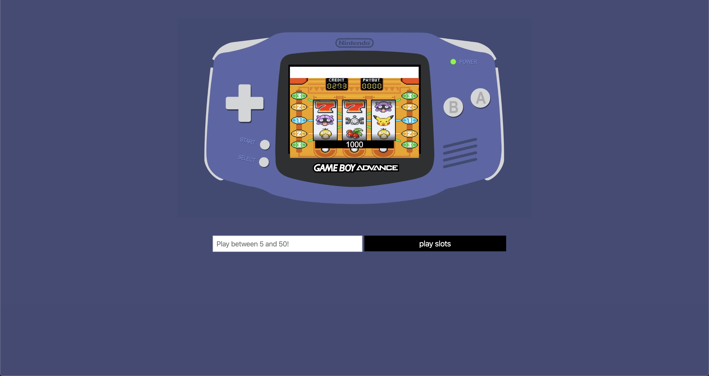

# Slot Machine
#### Design functional in browser slot machine. Use inputs bets between 5 and 50 credits. If three reels match, the return is doubled. 
#### View here: https://svdev-slot.netlify.com

# How it was made:
#### HTML5, CSS3, Javascript E6

# Optimizations:
#### When the player inputs their desired value of credits, the slots are played to potentially double the amount of credits played. 

# Lesson Learned: 
#### Math.floor() and Math.random() were essential to create the algorithms for the reels. I declared a let variable with the players initial amount to begin at 1000 and for every instance where the three reels match, a function runs in which the bet amount is multiplied by two and added to the current amount of credits remaining.   
